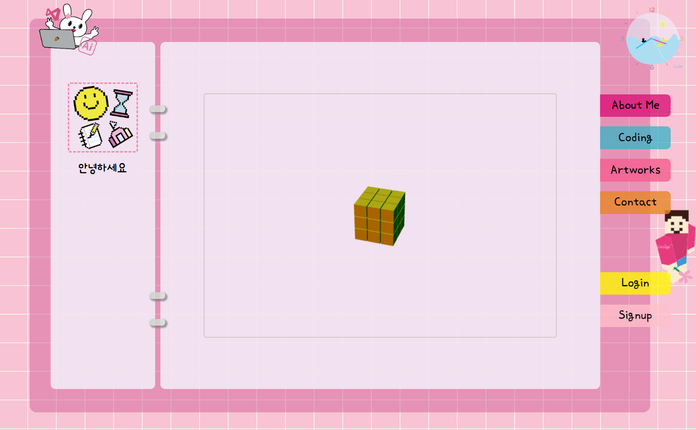
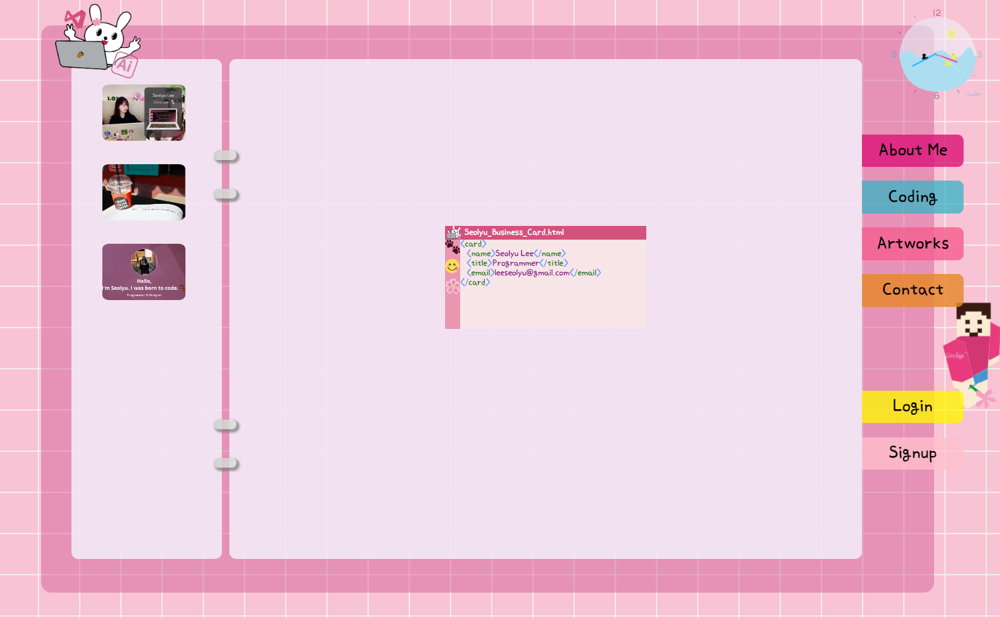
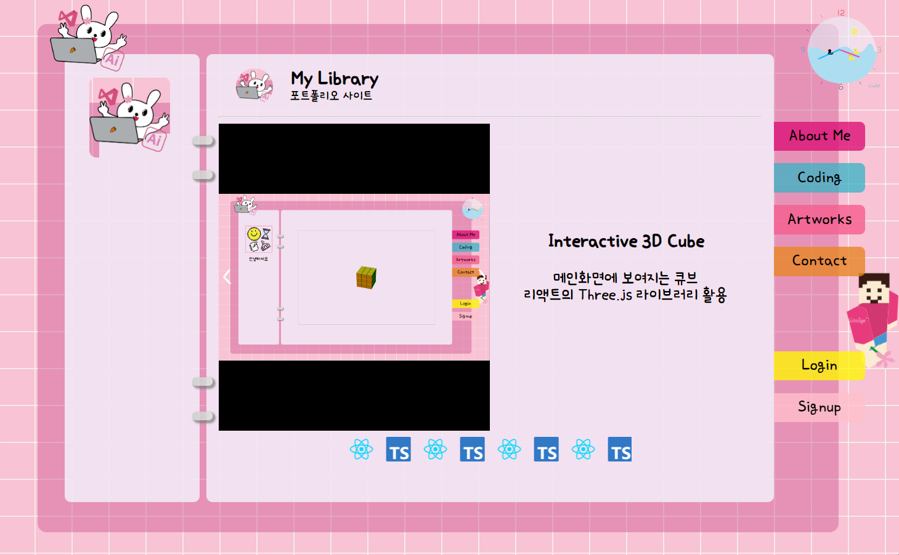
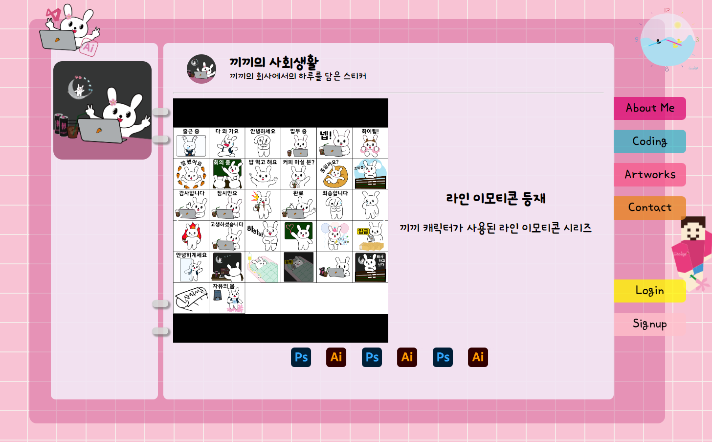
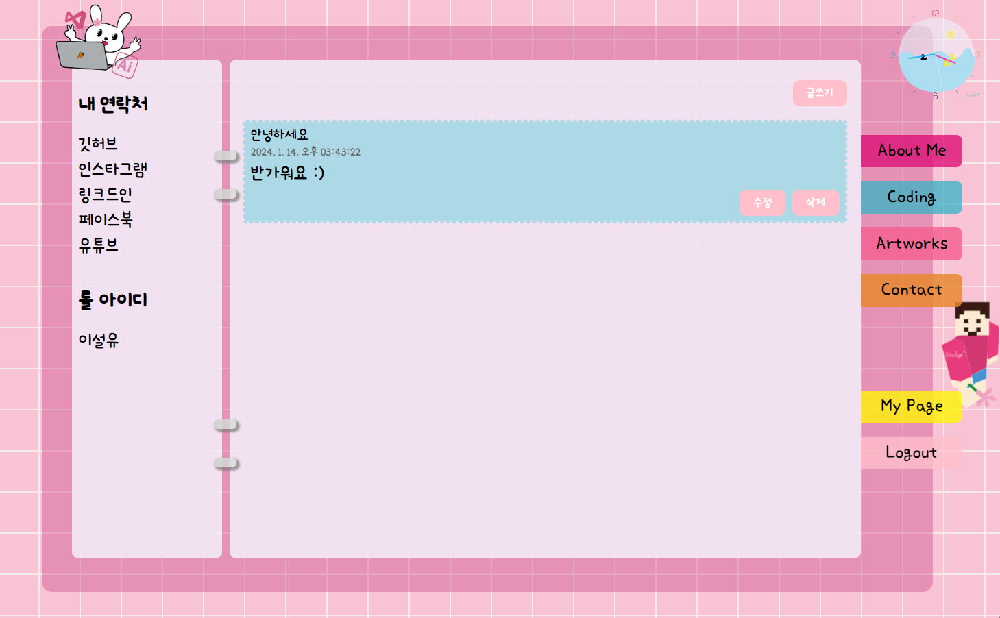

# [My Library](https://seolyudiary.web.app/) 📚

Welcome to "My Library," a portfolio site showcasing my coding projects and artworks. Developed using React and TypeScript, this site is a digital representation of my skills and creativity. Below are the key features and sections of the site.

---

### Features 🌟

### Interactive 3D Cube 🧊

- **Description**: A Cube on the main screen
- **Tech Used**: React with Three.js library for 3D effects.
  

### About Me 👩🏻‍💻

- **Description**: Digital business card section providing portfolio links
  

### Coding Projects 💻

- **Description**: Introduction of my toy project(s)
  

#### Artworks Gallery 🎨

- **Description**: A display of my digital art creations
  

#### Contact 📬

- **Description**: A guestbook for visitors
  

---

### Development Period 📅

January 14, 2024 - January 15, 2024

### Created by [Seolyu Lee](https://www.linkedin.com/in/seolyu/)
